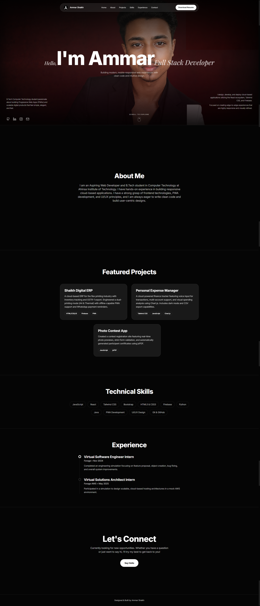

# 🚀 Ammar.dev | Interactive Portfolio Hero

A premium full-screen portfolio hero section built with **React 18**, **TypeScript**, **Vite**, **Tailwind CSS**, and **Framer Motion**.

The signature interaction is an ultra-smooth cursor-following spotlight that reveals a second portrait through a soft cinematic circular mask while maintaining 60 FPS performance.

> 🔗 **Live Demo:** https://Ammarsk22.github.io/ammar-portfolio/

---

# 🖼️ Screenshot

> Save your homepage screenshot as `public/screenshot.png`



---

# ✨ Features

- 🔦 **Cinematic Cursor Spotlight**
  - Smooth cursor-follow reveal effect
  - requestAnimationFrame animation
  - Lerp smoothing (`0.1`)
  - Soft radial mask

- 🎬 **Premium Reveal Animation**
  - Two perfectly aligned portraits
  - Circular spotlight reveal
  - Slow cinematic zoom

- ✨ **Ambient Particle System**
  - Floating background particles
  - Premium glassmorphism feel
  - Lightweight rendering

- 🔤 **Animated Typography**
  - Letter-by-letter animation
  - Blur → Fade → Slide transition
  - Staggered reveal timing

- 📱 **Fully Responsive**
  - Desktop
  - Tablet
  - Mobile
  - Portrait-safe image cropping

- ⚡ **Performance Optimized**
  - 60 FPS animation
  - No unnecessary React re-renders
  - Optimized image loading
  - High LCP performance

- ♿ **Accessibility**
  - Supports `prefers-reduced-motion`
  - Semantic HTML
  - Screen reader friendly

---

# 🛠 Tech Stack

| Technology | Purpose |
|------------|---------|
| React 18 | Component Architecture |
| TypeScript | Type Safety |
| Vite | Fast Development & Build |
| Tailwind CSS | Utility-first Styling |
| Framer Motion | Animations |
| Lucide React | Icons |

---

# 📂 Project Structure

```text
src/
│
├── components/
│   ├── Hero.tsx
│   ├── Navbar.tsx
│   ├── AnimatedText.tsx
│   ├── ParticleField.tsx
│   ├── SocialLinks.tsx
│   └── ScrollIndicator.tsx
│
├── hooks/
│   └── useSpotlightMask.ts
│
├── lib/
│   └── utils.ts
│
public/
│
├── images/
│   ├── Base_image.png
│   └── Reveal_image.png
│
└── screenshot.png
```

---

# 🔦 Spotlight Working

The spotlight effect works using a custom React hook.

### Flow

1. Generate a radial gradient using an off-screen canvas.
2. Convert the gradient into a PNG Data URL.
3. Apply it as a CSS Mask (`mask-image` / `-webkit-mask-image`).
4. Track mouse position.
5. Smooth movement using:

```ts
lerp = 0.1
```

6. Update the mask position using `requestAnimationFrame` for buttery smooth performance.

```tsx
useSpotlightMask({
  radius: 280,
  lerp: 0.1,
});
```

---

# 🚀 Installation

Clone the repository

```bash
git clone https://github.com/Ammarsk22/ammar-portfolio.git
```

Go to project folder

```bash
cd ammar-portfolio
```

Install dependencies

```bash
npm install
```

Run development server

```bash
npm run dev
```

Open

```
http://localhost:5173
```

---

# 📦 Production Build

```bash
npm run build
```

Preview production build

```bash
npm run preview
```

---

# ⚙️ Customization

### Resume

Replace

```
public/resume.pdf
```

with your own resume.

---

### Social Links

Update your links inside

```
SocialLinks.tsx
```

- GitHub
- LinkedIn
- Instagram
- Email

---

### Navigation

Create matching sections:

```
#about

#projects

#skills

#experience

#contact
```

---

### Portrait Images

Replace

```
public/images/Base_image.png
```

and

```
public/images/Reveal_image.png
```

If needed, adjust

```css
object-[50%_18%]
```

for perfect face alignment.

---

# ⚡ Performance

- requestAnimationFrame animation
- Optimized cursor tracking
- High priority LCP image
- Reduced Motion support
- GPU-friendly transforms
- Smooth 60 FPS rendering

---

# 👨‍💻 Developer

**Ammar Shaikh**

🎓 B.Tech Computer Technology

💻 Full Stack Developer

📧 Email: ammarsk200422@gmail.com

🌐 GitHub: https://github.com/Ammarsk22

---

# 📄 License

This project is intended for personal portfolio and educational purposes.
Feel free to fork and customize for your own portfolio.